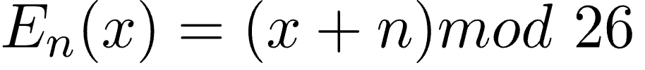
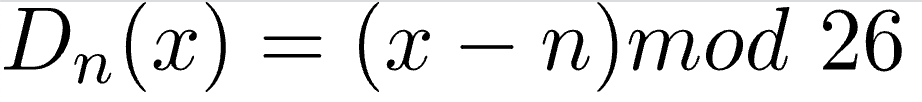
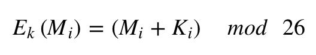
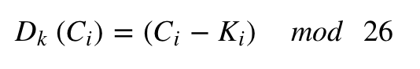

# Final Project for Programming Languages
_Marcela Fuentes (A01748161) and Juan Carlos Hurtado (A01025193)_

 

## Problem Description

Every single day, millions of files are transferred via de the Internet from people all around the world, incluidng a huge amount of personal data: emails with details about our personal lives, passwords that we type into login screens, tax documents that we upload to servers.

What if these files were intercepted while they're on their way?

It is no secret that Internet protocols send private data in packets on the same routes as everyone else's data, and unfortunately, attackers have figured out ways to look at the data travelling around the Internet.

That's where the need for encryption comes in: encrypting data means that we scramble the original data to hide the meaning of the text, while still making it possible for it to be unscrambled using a secret key.

In other words, encryption makes it possible for two people, or computers in this case, to share private information over open networks.

There are three key aspects of data encryption:
- **Encryption:** scrambling the data according to a secret key (in this case, the alphabet shift).
- **Decryption:** recovering the original data from scrambled data by using the secret key.
- **Code cracking:** uncovering the original data without knowing the secret, by using a variety of clever techniques.

Whenever we consider a possible encryption technique, we must ask ourselves some questions regarding the aforementioned aspects:
- *How easy is it to encrypt?*
- *How easy is it to decrypt?*
- *How easy is it for an attacker to crack the code?*

In the modern world, encryption is a necessary mean of security when dealing with private information being shared in the Internet. It is important to protect the data we're transferring in order to both protect our data and also ensure that the other party is receiving it correctly and without interference from any unwanted viewers.

## Solution Explanation

That's when (de)cipher comes in: we will allow the user to choose between three encryption techniques and upload a text file that they want to either encrypt or decrypt. The language used in the development of this project will be **Elixir**.

The following techniques will be implemented in the program:
- **Caesar Cipher**
    - This is one of the earliest and simplest method of encryption.
    - It is a type of substitution cipher: each letter of a given text is replaced by a letter some fixed number of positions down the alphabet.
    
    - The method is named after the Roman Emperor Julius Caesar, who according to historians used this technique to communicate with his officials.
    - The encryption and decryption can be represented using modular arithmetic by first transforming the letters into numbers.
    
    
    - How will it be coded:
        - Traverse the given text one character at a time.
        - For each character, transform the given character as per the rule, depending on whether we’re encrypting or decrypting the text.
        - Return the new string generated.
        - For decryption, apply the given shift in the opposite direction to decrypt the original text.
- **Vigenère Cipher**
    - The Vigenère cipher uses a 26×26 table with A to Z as the row heading and column heading.
        - The first row of this table has the 26 English letters.
        - Starting with the second row, each row has the letters shifted to the left one position in a cyclic way. 
        - For example, when B is shifted to the first position on the second row, the letter A moves to the end.
    
    - In addition to the plaintext, the Vigenère cipher also requires a keyword, which is repeated so that the total length is equal to that of the plaintext.
    - How will it be coded:
        - We follow the tradition by removing all spaces and punctuation, converting all letters to upper case, and dividing the result into 5-letter blocks.
        - To encrypt, pick a letter in the plaintext and its corresponding letter in the keyword, use the keyword letter and the plaintext letter as the row index and column index, respectively, and the entry at the row-column intersection is the letter in the ciphertext.
        - Repeat this process until all plaintext letters are processed.
            - The process can also be represented by a mathematical equation:
            
        - To decrypt, pick a letter in the ciphertext and its corresponding letter in the keyword, use the keyword letter to find the corresponding row, and the letter heading of the column that contains the ciphertext letter is the needed plaintext letter.
            - The process can also be represented by a mathematical equation:
            
- **One-time Pad**
    - One-time pad (OTP), also called Vernam-cipher or the perfect cipher, is a crypto algorithm where plaintext is combined with a random key.
    - It is the only existing mathematically unbreakable encryption.
    - Used by Special Operations teams and resistance groups during WW2, popular with intelligence agencies and their spies during the Cold War and beyond, protecting diplomatic and military message traffic around the world for many decades, the one-time pad gained a reputation as a simple yet solid encryption system with an absolute security which is unmatched by today's modern crypto algorithms.
    - We can only talk about one-time pad if some important rules are followed; even infinite computational power and infinite time cannot break one-time pad encryption, simply because it is mathematically impossible. However, if only one of these rules is disregarded, the cipher is no longer unbreakable.
        - The key is at least as long as the message or data that must be encrypted.
        - The key is truly random (not generated by a simple computer function or such)
        - Key and plaintext are calculated modulo 10 (digits), modulo 26 (letters) or modulo 2 (binary)
        - Each key is used only once, and both sender and receiver must destroy their key after use.
        - There should only be two copies of the key: one for the sender and one for the receiver (some exceptions exist for multiple receivers)
    - How will it be coded:
        - To encrypt a letter, a user needs to write a key underneath the plaintext.
            - The plaintext letter is placed on the top and the key letter on the left.
            - The cross section achieved between two letters is the plain text.
        - To decrypt a letter, user takes the key letter on the left and finds cipher text letter in that row.
            - The plain text letter is placed at the top of the column where the user can find the cipher text letter.

## References
- Fox, P. (n.d.). _The Need for Encryption_. Khan Academy. Recovered from https://www.khanacademy.org/computing/computers-and-internet/xcae6f4a7ff015e7d:online-data-security/xcae6f4a7ff015e7d:data-encryption-techniques/a/the-need-for-encryption
- GeeksForGeeks. (April 6, 2021). _Caesar Cipher in Cryptography_. Recovered from https://www.geeksforgeeks.org/caesar-cipher-in-cryptography/
- Rijmenants, D. (n.d.). _One-time Pad_. Cipher Machines and Cryptology. Recovered from http://users.telenet.be/d.rijmenants/en/onetimepad.htm
- Shene, C. K. (n.d.). _The Vigenère Cipher Encryption and Decryption_. Michigan Technological University. Recovered from https://pages.mtu.edu/~shene/NSF-4/Tutorial/VIG/Vig-Base.html
- TutorialsPoint. (n.d.). _One Time Pad Cipher_. Recovered from https://www.tutorialspoint.com/cryptography_with_python/cryptography_with_python_one_time_pad_cipher.htm
- TutorialsPoint. (n.d.). _Understanding Vignere Cipher_. Recovered from https://www.tutorialspoint.com/cryptography_with_python/cryptography_with_python_understanding_vignere_cipher.htm
